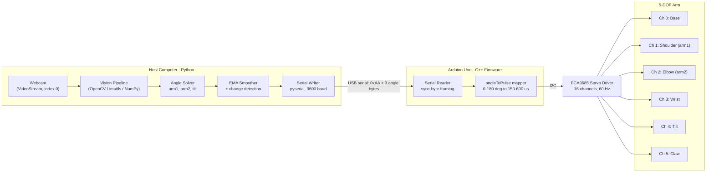
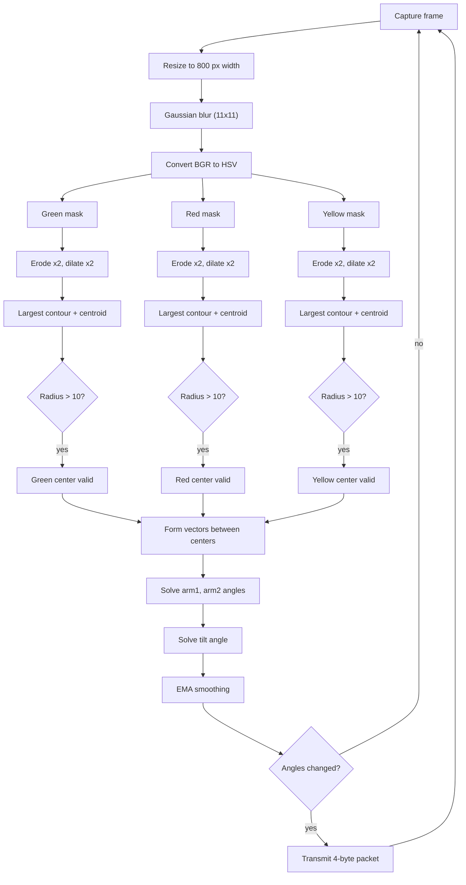
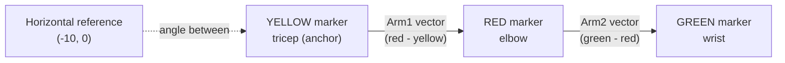
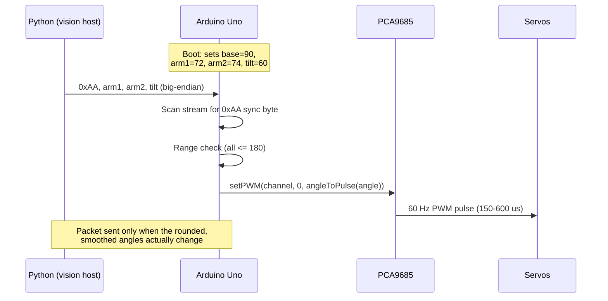
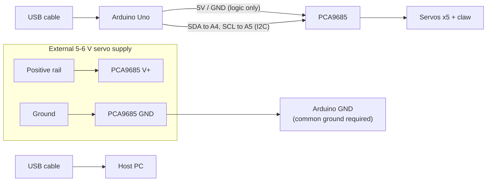

# Gesture-Controlled 5-DOF Robotic Arm using Computer Vision

A gesture-controlled, 3D-printable, 5-degrees-of-freedom, desktop-sized robotic arm that mimics human arm movements in real time. The arm is actuated by three standard servos and two micro servos, driven through a PCA9685 PWM servo driver board. Human arm pose is captured with a standard webcam using OpenCV colour tracking, and joint angles are streamed to an Arduino Uno over a compact binary serial protocol.

This repository contains the complete control software: the Python vision pipeline, the Arduino firmware, a serial communication test harness, two HSV colour-calibration tools, and a PCA9685 channel diagnostic sketch.

## Features

- Real-time pose tracking of a human arm using three coloured markers (yellow on the tricep, red on the elbow, green on the wrist) with a plain webcam.
- 2-DOF shoulder/elbow angle extraction from marker geometry, plus an automatic wrist-tilt solution that keeps the gripper horizontal.
- Exponential moving average (EMA) smoothing and change detection to eliminate servo jitter and reduce serial traffic.
- Robust framed serial protocol with a sync byte and range checks, so corrupted bytes can never command the arm.
- PCA9685 16-channel PWM driver support, freeing the Arduino from generating all PWM in software and allowing easy channel remapping.
- Two calibration tools: an interactive trackbar tuner (`hsv_tune.py`) and a fully automatic, GUI-free calibrator (`auto_hsv.py`).

## System Architecture

The system is split between the host computer (heavy vision processing) and the microcontroller (real-time PWM generation). The host computes three joint angles per frame and transmits them only when they change.



Only `arm1` (shoulder), `arm2` (elbow), and `tilt` are transmitted. The tilt angle is not tracked directly; it is solved geometrically so the manipulator stays horizontal regardless of shoulder and elbow positions. The base and claw servos are held at fixed positions by the firmware and can be extended to be gesture-controlled.

## Vision Pipeline

Every camera frame passes through the following stages. The three colour channels are processed independently and in parallel within the same loop.



## Gesture Geometry and Angle Computation

The three markers form two vectors in the image plane. The shoulder angle (`arm1`) is the angle between the upper-arm vector and the horizontal; the elbow angle (`arm2`) is the angle between the forearm vector and the upper-arm vector.



| Joint | Formula | Output clamp |
| --- | --- | --- |
| arm1 (shoulder) | Angle between (red - yellow) and the horizontal reference, minus an 18-degree mounting offset | 50 to 160 degrees |
| arm2 (elbow) | Angle between (green - red) and the Arm1 vector, minus a 16-degree mounting offset | 10 to 154 degrees |
| tilt (wrist) | Solved from arm1 and arm2 so the gripper stays level: `tilt = -(180 - (arm2 + 16) - (180 - (arm1 + 18))) + 60` | 0 degrees minimum |

Vectors are only accepted when their length falls within a physical plausibility window (80 to 300 px for arm1, 100 to 230 px for arm2), which rejects false detections and marker occlusion. All angles are checked for NaN before transmission.

## Serial Protocol

Python and the Arduino communicate at 9600 baud with a fixed 4-byte packet. The Arduino discards every byte until it sees the sync byte `0xAA`, which makes byte misalignment harmless, and it additionally range-checks every angle byte before moving a servo.

| Byte | Index | Value | Meaning |
| --- | --- | --- | --- |
| 1 | 0 | `0xAA` (170) | Sync byte |
| 2 | 1 | 0 to 180 | arm1, shoulder angle in degrees |
| 3 | 2 | 0 to 180 | arm2, elbow angle in degrees |
| 4 | 3 | 0 to 180 | tilt, wrist angle in degrees |



On the firmware side, `angleToPulse` maps 0 to 180 degrees onto 150 to 600 counts at 60 Hz. The oscillator frequency is set to 27 MHz, which is typical for common clone PCA9685 boards; if your servos travel to the wrong positions, tune this value.

## Hardware Setup

| Component | Role |
| --- | --- |
| Arduino Uno | Receives angle packets over USB, drives the PCA9685 over I2C |
| PCA9685 16-channel PWM board | Generates the 60 Hz servo pulses on 6 channels |
| 3x standard servos | Base rotation, shoulder (arm1), elbow (arm2) |
| 2x micro servos | Wrist tilt, claw |
| Webcam | Any UVC camera usable by OpenCV |
| Markers | Yellow (tricep), red (elbow), green (wrist) - LEGO blocks with velcro tape work well |



Wiring essentials:

- PCA9685 V+ must come from an external 5-6 V supply capable of several amps. Do not power five servos from the Arduino 5 V pin.
- The PCA9685, the servo supply, and the Arduino must share a common ground.
- SDA goes to Arduino A4 and SCL to A5 (Uno hardware I2C pins).
- The firmware drives channels 0 to 5 as listed in the architecture section. If a servo moves the wrong joint, run `diag_test/diag_test.ino`, which sweeps channels 0 to 5 one at a time so you can match channels to joints, then update the `CH_*` defines in the main sketch.

## Repository Structure

```text
RoboticArm/
├── README.md                                   This document
├── .gitignore
└── Gesture-Controlled-5-DOF-Robotic-Arm-using-Computer-Vision/
    ├── Gesture_Controlled_Robotic_Arm_Python_Code.py   Main vision + control program
    ├── Gesture_Controlled_Robotic_Arm_Arduino_Code/    Main Arduino firmware (PCA9685)
    │   └── Gesture_Controlled_Robotic_Arm_Arduino_Code.ino
    ├── diag_test/                              PCA9685 channel-sweep diagnostic sketch
    ├── hsv_tune.py                             Interactive HSV calibration (trackbars)
    ├── auto_hsv.py                             Automatic HSV calibration (no GUI)
    ├── test_serial.py                          Serial link verification script
    ├── requirements.txt                        Python dependencies
    ├── LICENSE                                 MIT (original project)
    └── venv/                                   Local virtualenv (not committed)
```

## Startup Guide

### 1. Prerequisites

- A computer with Python 3.9 or newer and a webcam.
- Arduino IDE (or arduino-cli) for flashing the firmware.
- The assembled 5-DOF arm with an Arduino Uno and PCA9685 driver. STL files and a full parts list are available on the GrabCAD page linked under Credits.
- Arduino library: Adafruit PWM Servo Driver Library (install via the Arduino IDE Library Manager). `Wire.h` ships with the IDE.
- Three coloured markers: yellow on the tricep, red on the elbow, green on the wrist.

### 2. Wire the hardware

1. Connect all servo signal wires to PCA9685 channels 0 to 5 as per the channel map above.
2. Power the PCA9685 V+ terminal from an external 5-6 V supply; tie all grounds together.
3. Connect SDA and SCL to the Uno's A4 and A5.
4. Connect the Uno to the computer over USB.

### 3. Flash the Arduino

1. In the Arduino IDE, open `Gesture-Controlled-5-DOF-Robotic-Arm-using-Computer-Vision/Gesture_Controlled_Robotic_Arm_Arduino_Code/Gesture_Controlled_Robotic_Arm_Arduino_Code.ino`.
2. Install the Adafruit PWM Servo Driver Library if you have not already.
3. Select your board (Arduino Uno) and serial port, then click Upload.
4. Optional but recommended: first flash `diag_test/diag_test.ino` to sweep each channel in turn and verify which channel drives which joint. The onboard LED lights while a channel is being swept.

### 4. Set up the Python environment

From the repository root:

```bash
cd Gesture-Controlled-5-DOF-Robotic-Arm-using-Computer-Vision
python3 -m venv venv
source venv/bin/activate          # Windows: venv\Scripts\activate
pip install -r requirements.txt
```

Dependencies: `opencv-python`, `imutils`, `numpy`, `pyserial`.

### 5. Configure the serial port

Edit the port in two places:

- `Gesture_Controlled_Robotic_Arm_Python_Code.py`, line 32: `arduino = serial.Serial('/dev/cu.usbserial-130', 9600)`
- `test_serial.py`, line 13: `PORT = '/dev/cu.usbserial-130'`

Find your port with:

```bash
ls /dev/cu.usb*                # macOS
ls /dev/ttyUSB* /dev/ttyACM*   # Linux
# Windows: COM3, COM4, ... (check Device Manager)
```

To try the vision pipeline without any hardware, comment out the `serial.Serial(...)` line in the main script; the window will still track your arm.

### 6. Calibrate the HSV colour bounds

Lighting changes everything, so calibrate in the room where you will run the arm. Either tool writes its final six values to `/tmp/hsv_<color>.log`.

Interactive tuner (adjust trackbars until only the target block is white in the mask, then press ESC):

```bash
python hsv_tune.py green
python hsv_tune.py red
python hsv_tune.py yellow
```

Automatic calibrator (hold the marker in front of the camera; it captures 30 frames, finds the dominant colour cluster, and prints tight bounds):

```bash
python auto_hsv.py green
python auto_hsv.py red
python auto_hsv.py yellow
```

Copy the resulting lower/upper tuples into lines 15 to 22 of `Gesture_Controlled_Robotic_Arm_Python_Code.py`:

```python
greenLower  = (38, 95, 72);   greenUpper  = (96, 255, 255)
redLower    = (0, 122, 119);  redUpper    = (10, 255, 255)
yellowLower = (15, 119, 76);  yellowUpper = (29, 255, 255)
```

### 7. Verify the serial link

With the Arduino plugged in and the main sketch flashed, put the arm somewhere it can move freely, then run:

```bash
python test_serial.py
```

The script sends the startup pose (arm should stay still), nudges the shoulder to 90 degrees, and returns to startup. If the shoulder joint moves, communication works.

### 8. Run the arm

```bash
python Gesture_Controlled_Robotic_Arm_Python_Code.py
```

Stand so all three markers are visible, roughly arm's length from the camera. A window titled `Frame` shows the detected circles and vectors. Press `q` to quit safely.

## Configuration Reference

| Where | Parameter | Default | Purpose |
| --- | --- | --- | --- |
| Main Python, lines 15-22 | Colour bounds | see code | HSV lower/upper bounds for green, red, yellow masks |
| Main Python, line 32 | Serial port | `/dev/cu.usbserial-130` | Arduino port, 9600 baud |
| Main Python, line 171 | `SMOOTH` | 0.4 | EMA factor; 0 freezes, 1 disables smoothing |
| Main Python, line 52 | Frame width | 800 px | Higher is sharper but slower |
| Main Python, lines 137-158 | Angle clamps | arm1: 50-160, arm2: 10-154 | Joint safety limits |
| Arduino sketch, lines 10-15 | `CH_*` defines | 0-5 | PCA9685 channel to joint mapping |
| Arduino sketch | `PULSE_MIN` / `PULSE_MAX` | 150 / 600 | Servo pulse limits at 60 Hz |
| Arduino sketch | `setOscillatorFrequency` | 27000000 | Tune if servo travel is inaccurate |

## Troubleshooting

| Symptom | Likely cause and fix |
| --- | --- |
| `SerialException` / permission denied on the port | Wrong port or port held by the Arduino Serial Monitor. Close the monitor and re-check `ls /dev/cu.usb*`. |
| Arm does nothing on `test_serial.py` | Wrong port, wrong baud, or the sketch was not uploaded. The Uno auto-resets when the port opens; the test waits 2.5 s for this. |
| Servos twitch or brown out | Servo power is inadequate. Use an external 5-6 V supply rated several amps; never power servos from the Uno's 5 V rail. |
| Servo moves the wrong joint | Channel map mismatch. Run `diag_test.ino` and update the `CH_*` defines. |
| Mask covers half the frame | HSV bounds too loose. Recalibrate with `hsv_tune.py` or `auto_hsv.py`. |
| Arm follows another coloured object | Tighten bounds, keep lighting consistent, or use more saturated markers. |
| Arm movement is jittery | Lower `SMOOTH` (e.g. 0.3) for more smoothing, or improve marker visibility. |
| Angles seem offset by a constant | Adjust the 18-degree and 16-degree mounting offsets in the angle solver to match your servo horn installation. |
| Camera fails to open | Another app is using it, or the index in `VideoStream(src=0)` is wrong. Try `src=1`. |

## Project Origins and Credits

This project is based on "Gesture Controlled 5 DOF Robotic Arm using Computer Vision" by Jingzhou Liu (JasonJZLiu), MIT licensed. This repository extends that work with: the PCA9685 servo driver firmware replacing direct Arduino PWM, the sync-byte framed serial protocol with range checking, EMA smoothing with change-based transmission, the `hsv_tune.py` and `auto_hsv.py` calibration tools, and the `test_serial.py` communication harness.

- Original project: https://github.com/JasonJZLiu/Gesture-Controlled-5-DOF-Robotic-Arm-using-Computer-Vision
- Demo video: https://www.youtube.com/watch?v=PDEdxRVkMdo
- 3D-printable STL files and full parts list: https://grabcad.com/library/5-dof-robotic-arm-6

## License

MIT License. Copyright (c) 2020 Jingzhou Liu. See the LICENSE file in the project directory.


